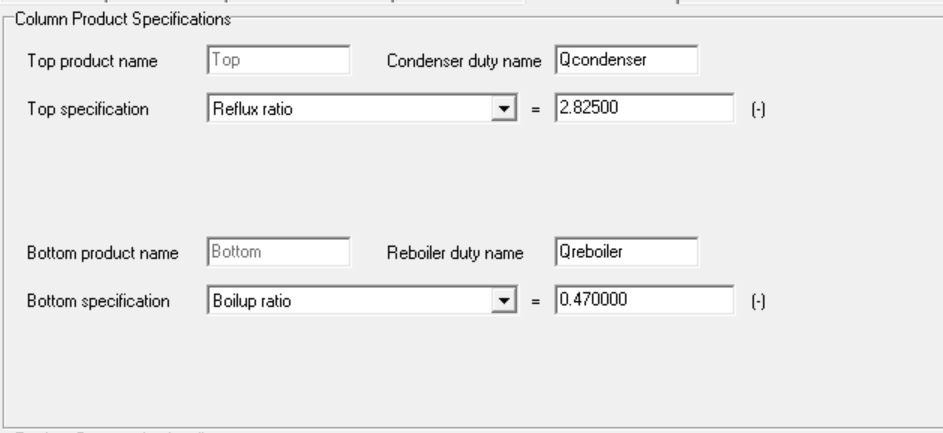
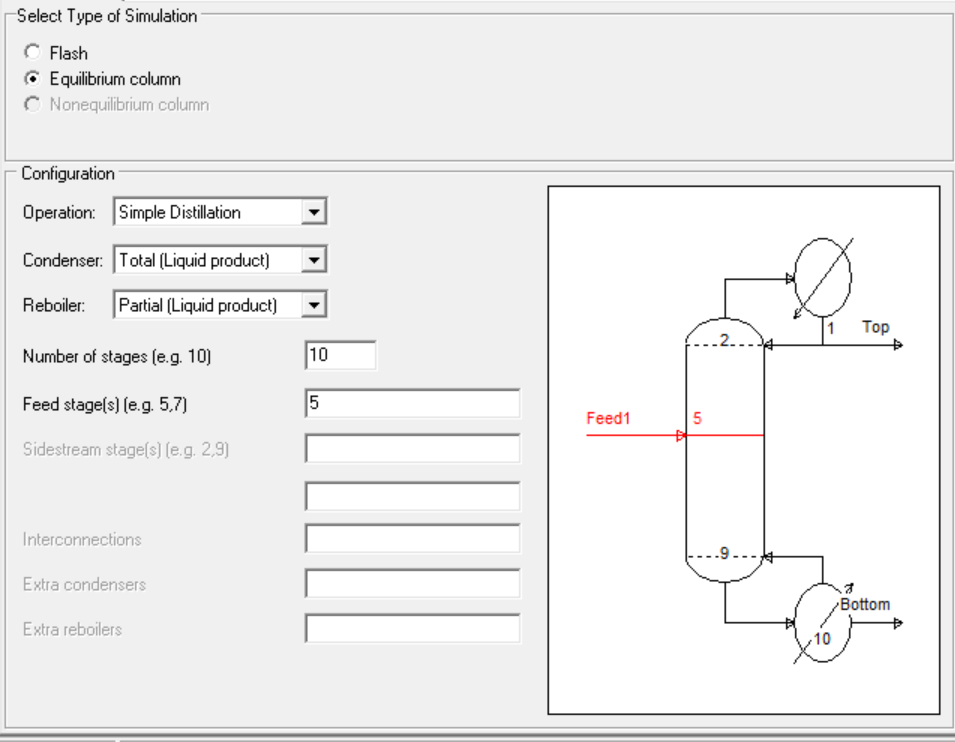
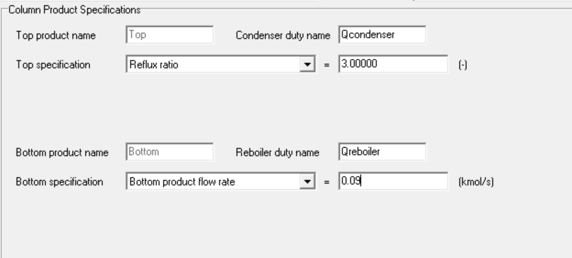

# ChemSep Configuration

## ChemSep Process Flowsheet

Figure 3. ChemSep process flowsheet developed for the present work.

---

## Column 1 Configuration

  
  

Figure 4. Extractive distillation column configuration.

---

## Column 2 Configuration

  
  

Figure 5. Solvent recovery column configuration.
