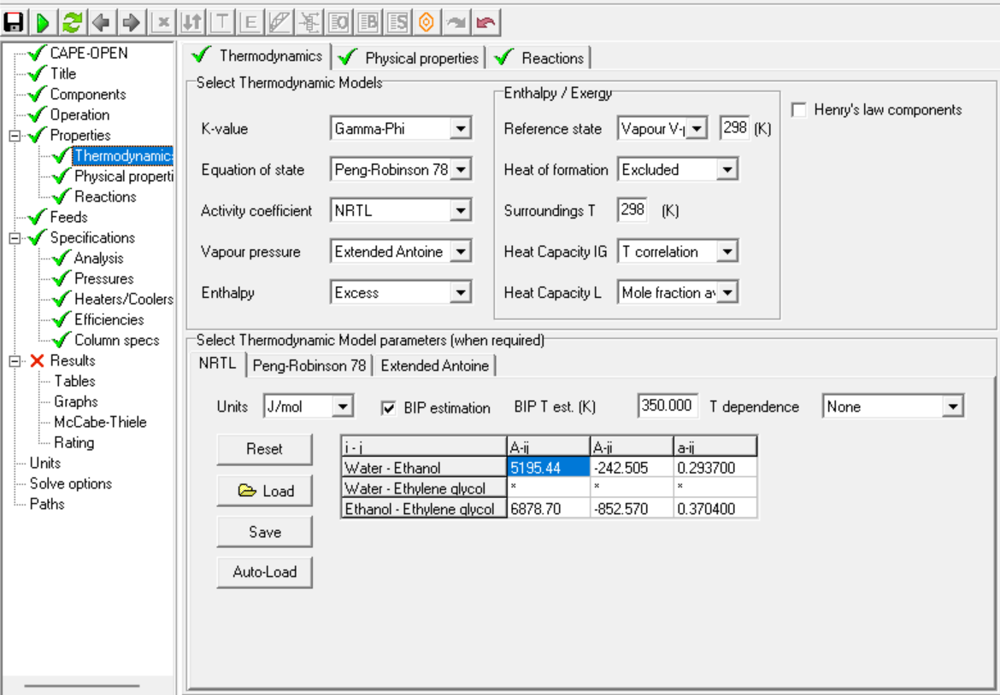

# Thermodynamic Model

The selection of an accurate thermodynamic property package is critical for modeling the non-ideal behavior of the ethanol-water-ethylene glycol system and properly shifting the minimum-boiling azeotrope.

## Model Specifications

- **Property Package:** Gamma-Phi
- **Activity Model:** NRTL
- **Equation of State:** Peng-Robinson
- **Vapour Pressure:** Extended Antoine

---

## Model Selection Reference

*Figure 4. Thermodynamic model configuration and phase behavior parameters.*
